# NANOHANA AI 第1話「発動」絵コンテ

ましろの普通の朝から、帰り道の異変、白い円の発動と失神、病院での目覚めまでを描く41秒の予告編。あすかの問いかけで、人との関わりが始まるところまでつなぐ。

制作上の決定：あすかは細身の肩・胴体と白衣のシルエットを維持。ましろは黒ボブ、紺ブレザー、青いリボンを維持。発動後の膝崩れ・倒れる場面は、川に面した横方向の欄干と遠景のアーチ橋を揃える。台詞は字幕で、キャラクター音声は未収録。人物は静止作画を使用し、文字とカメラを動かす。後付けの魔法エフェクトは使わない。

## カット順

### CUT 01｜寮の朝（0–3秒）

窓辺のましろ。菜の花の見える、いつもの朝から始まる。

字幕：三月の終わり。

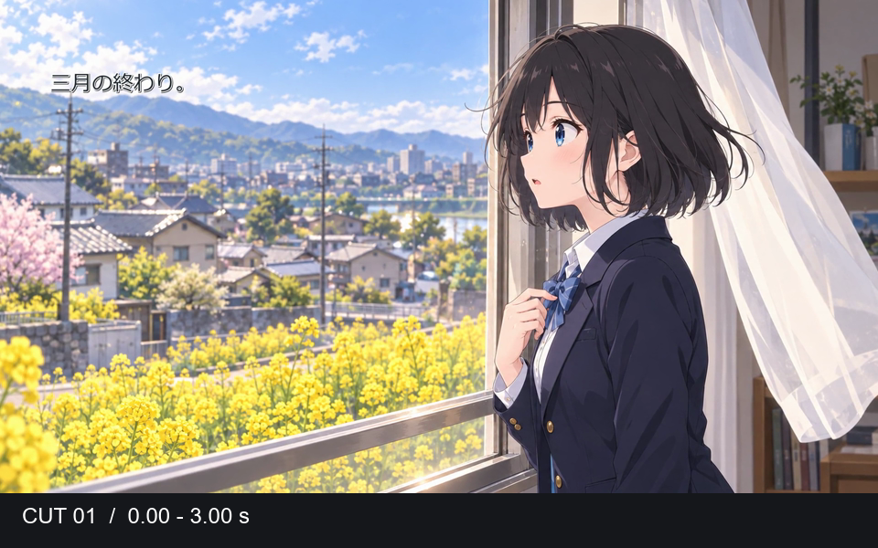

### CUT 02｜授業中のノート（3–5秒）

ノートに菜の花を描く手元。守りたい日常を短いカットで見せる。

字幕：いつもの、一日。

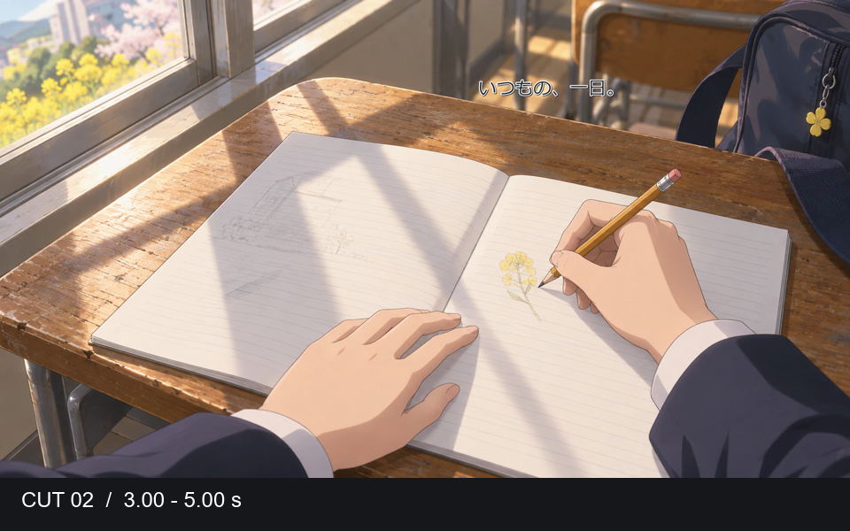

### CUT 03｜封鎖に気づく（5–8秒）

帰り道でましろが立ち止まり、封鎖テープの向こうを見る。

字幕：帰り道が、

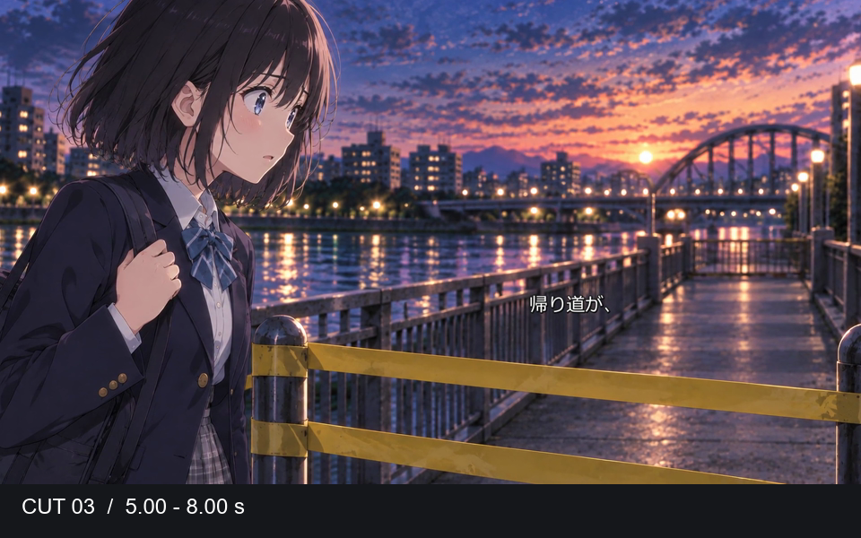

### CUT 04｜橋の異変（8–10秒）

橋の向こうに動かない人々。ましろの視線の先を見せる。

字幕：止まっていた。

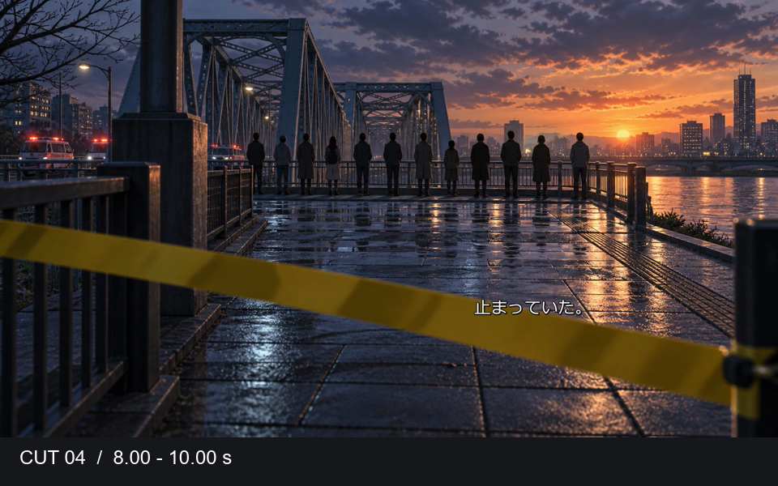

### CUT 05｜あすかが進む（10–12秒）

白衣の裾と足元。あすかが封鎖の先へ進む。

字幕：「下がって」

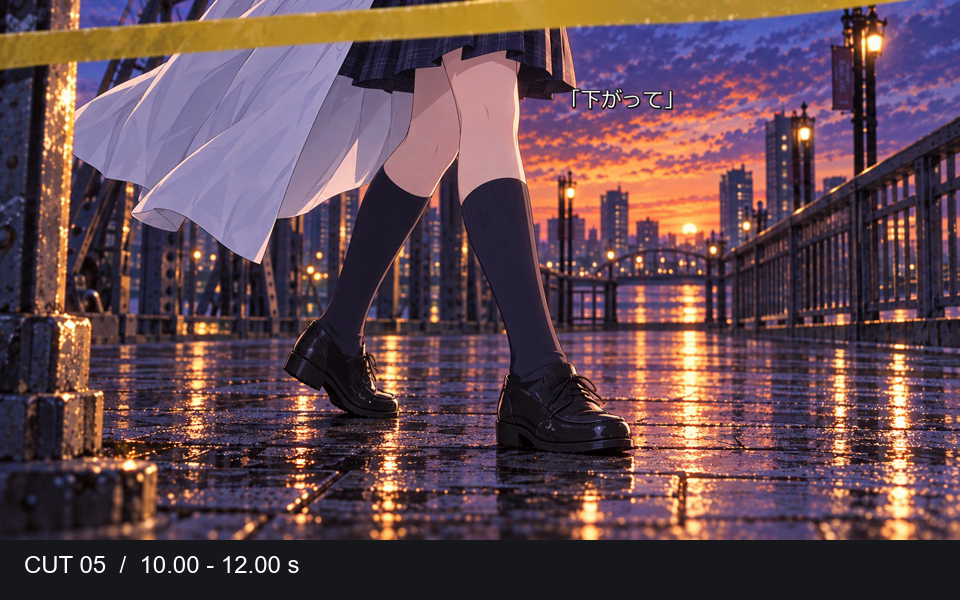

### CUT 06｜千里眼（12–16秒）

あすかが目を閉じて力を使う。元の絵にある光だけを見せる。

字幕：開眼し、／現実を見渡せ

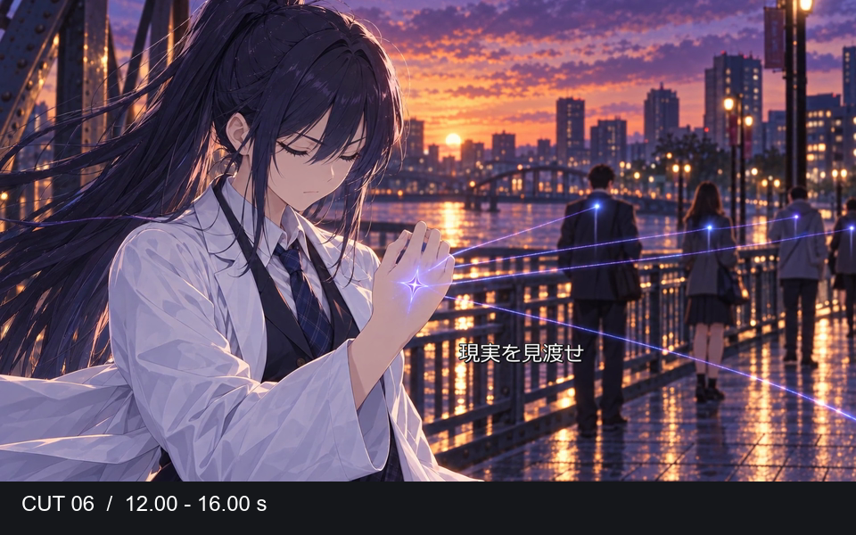

### CUT 07｜ましろの発動（16–20秒）

ましろの手の甲に白い円が現れる。本人は戸惑い、消そうとする。

字幕：え、／なにこれ。／消えて。

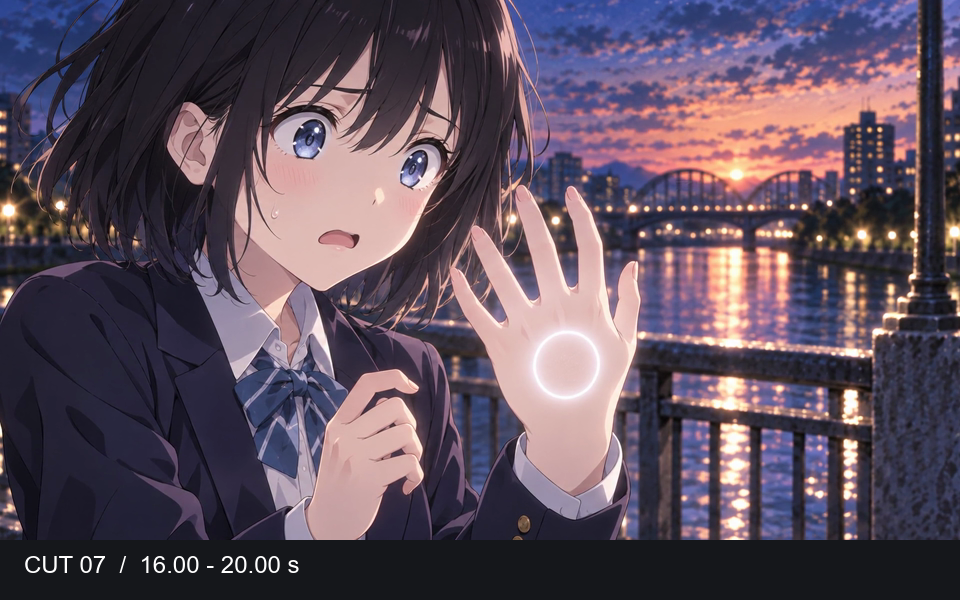

### CUT 08｜系譜のない力（20–23秒）

橋上のましろを俯瞰で見せる。後付けの円や粒子は重ねない。

字幕：誰の系譜でもない。

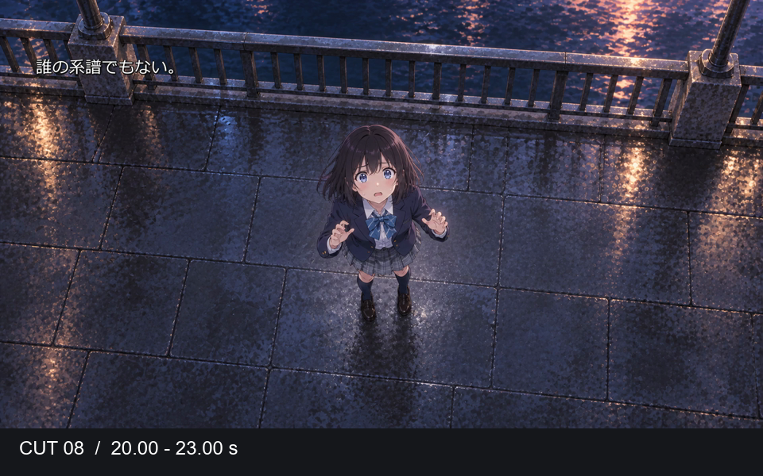

### CUT 09｜あすかの反応（23–26秒）

細身に修正したあすかが目を開く。見たことのない発動に驚く。

字幕：「……なに、あれ」

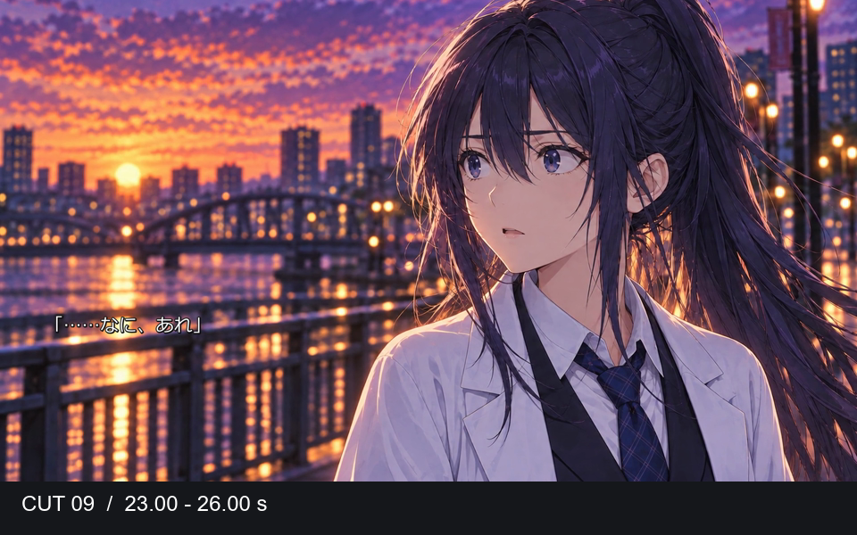

### CUT 10｜光が消え、力が抜ける（26–28秒）

ましろの手の光は消えている。安心した直後、膝から力が抜ける。

字幕：「あ、消えた」

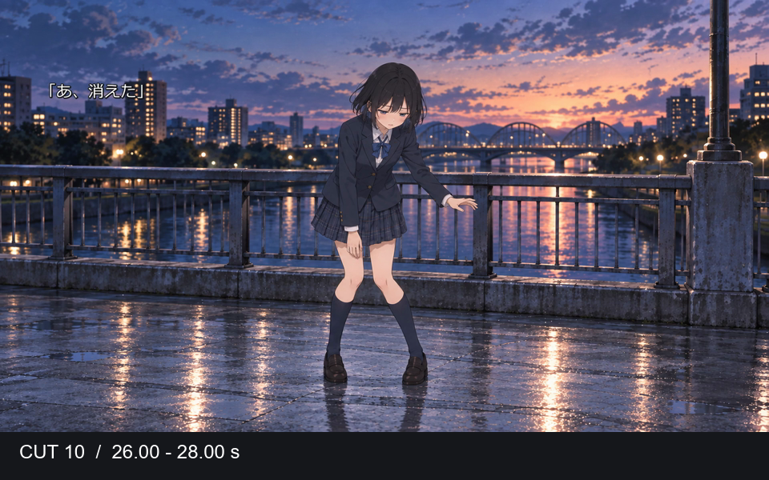

### CUT 11｜倒れる（28–30秒）

同じ欄干・川・遠景の橋を背に、ましろが横たわる。字幕を切って倒れた事実を見せる。

字幕：なし

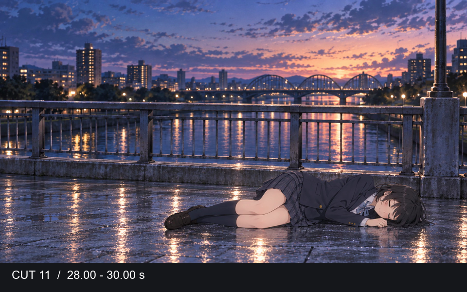

### CUT 12｜暗転（30–31秒）

意識が途切れ、時間と場所が変わる。

字幕：なし

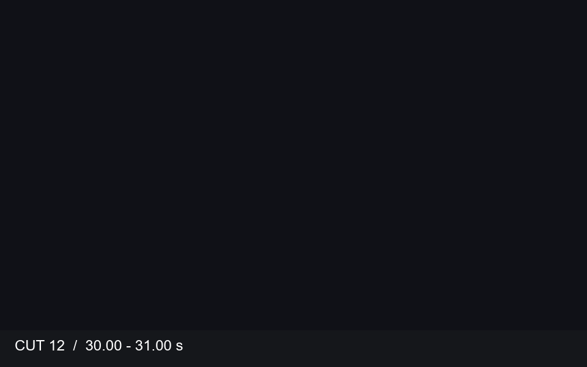

### CUT 13｜病院で目覚める（31–36秒）

ましろが病室で目を覚ます。そばにいるあすかが心配そうに声をかける。

字幕：目が覚めると、病院にいた。／「大丈夫？」

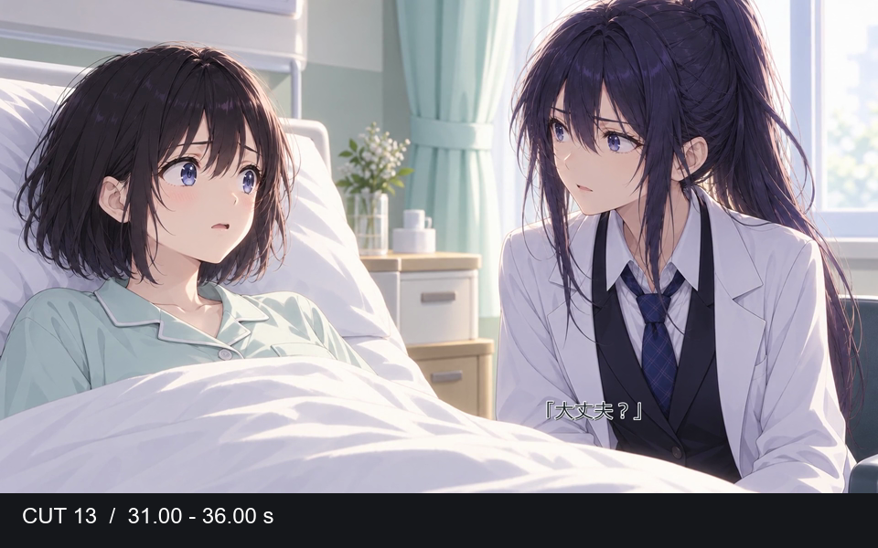

### CUT 14｜タイトル（36–41秒）

NANOHANA AIの文字が順に現れ、第1話の題名で締める。

字幕：誰のものでもない、白い花。／NANOHANA AI／第1話「発動」

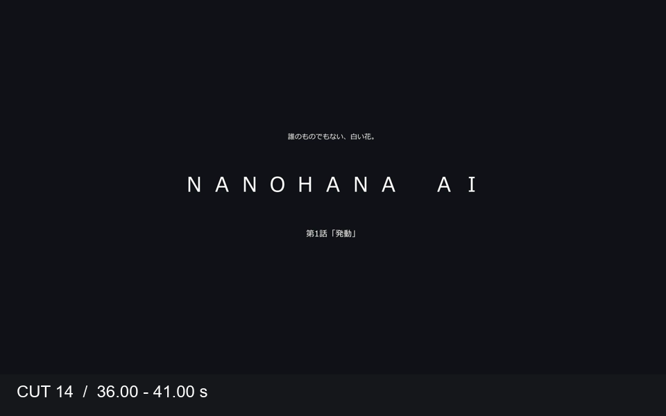
